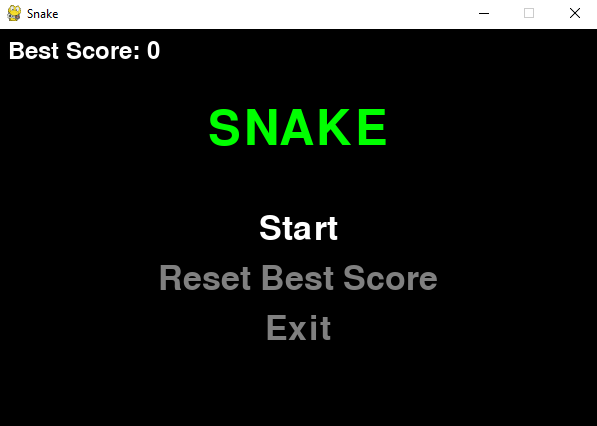
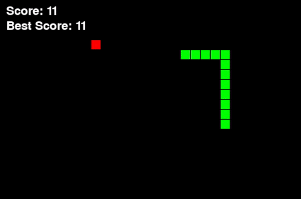

# Basic Snake Game
## About The Project
This Python project implements a classic Snake game using the Pygame library. The game features a snake that moves around the screen, consuming food to grow longer while avoiding collisions with itself.

     

**How to Play**:
- Use the arrow keys to navigate the snake (up, down, left, right).
- The snake will automatically move in the chosen direction.
- Eat the food (red squares) to grow longer and increase your score.
- Avoid colliding with the snake's own body.
- The game speed increases as your score goes up, providing a more challenging experience.
- Press 'Esc' to return to the main menu at any time.
- From the main menu, you can start the game, reset the best score, or exit the game entirely.

     

## License
Distributed under the MIT License. See [`LICENSE`](/LICENSE) for more information.